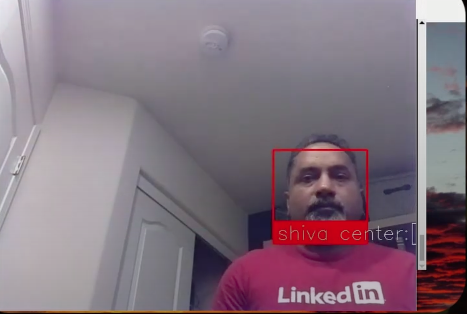
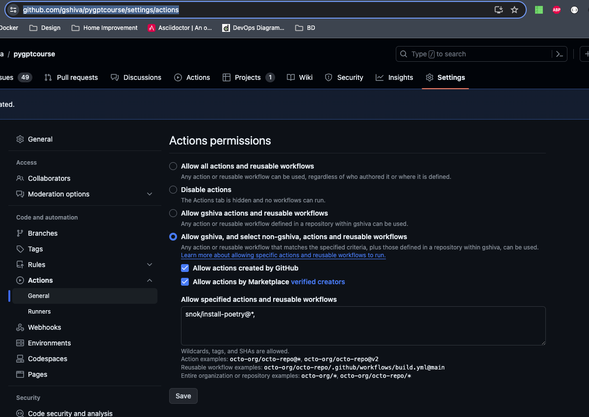

# pygptcourse

[](https://github.com/gshiva/pygptcourse/actions/workflows/ci.yml)

Face detection, tracking using OpenCV, USB micro T-Shirt launcher and RaspberryPi camera module to demonstrate how ChatGPT can speed up development and writing clean and SOLID code.

## Documentation generated for T-Shirt Launcher Project by ChatGPT

The following documentation was 95% generated by ChatGPT after copy/pasting the main.py, tracker.py and tshirt_launcher.py code
To see the prompts used, see <https://chat.openai.com/share/e71885d2-8639-409d-bf7a-2809801135f0>

## Micro T-Shirt Launcher

This repository contains Python code for launching micro T-Shirts to a particular person identified through face recognition.
The launcher positions itself using it's pan and tilt capabilities to launch the micro T-Shirt towards the identified person's location.
The micro T-Shirt launcher does not launch T-Shirt if the person is not in the pre-loaded facial image set.
The ability to develop, test and debug the launcher and facial recognition functionality independently is present.

## Requirements

- Python 3.x
- PyUSB library
- Poetry > 1.5.X

## Installation

1. Clone the repository:

   ```bash
   git clone https://github.com/gshiva/pygptcourse.git
   ```

1. Install the required dependencies:

   ```bash
   # if poetry is not installed
   # curl -sSL https://install.python-poetry.org | python3 -
   poetry install
   ```

   1. Raspberry Pi:

      1. Pre-requisites:
         For faster and reliable install, use [Raspberry Pi OS Bullseye](https://downloads.raspberrypi.com/raspios_oldstable_armhf/images/raspios_oldstable_armhf-2023-12-06/2023-12-05-raspios-bullseye-armhf.img.xz).
         Binary wheels packages are available for `opencv-python` only for Bullseye currently. See [pi wheels/opencv-python wheel](https://www.piwheels.org/project/opencv-python/)
         Install the pre-requisites:

         ```shell
         sudo apt install -y libatlas-base-dev libhdf5-dev libopenblas-dev
         ```

      1. Fix pyproject.toml manually:

         Change the primary poetry packages source from `PyPI` to `piwheels`:

         From:

         ```toml
         [[tool.poetry.source]]
         name = "piwheels.org"
         url = "https://www.piwheels.org/simple"
         priority = "supplemental"

         [[tool.poetry.source]]
         name = "PyPI"
         priority = "primary"
         ```

         To:

         ```toml
         [[tool.poetry.source]]
         name = "piwheels.org"
         url = "https://www.piwheels.org/simple"
         priority = "primary"

         [[tool.poetry.source]]
         name = "PyPI"
         priority = "supplemental"
         ```

         Delete the `poetry.lock` file

         ```shell
         rm poetry.lock
         ```

      1. Most likely you will run into `KeyRing` errors when installing over ssh on raspberry pi.

         To get around it:

         ```shell
         export PYTHON_KEYRING_BACKEND=keyring.backends.null.Keyring
         poetry install
         ```

         should work. See [GitHub issue](https://github.com/python-poetry/poetry/issues/1917) for further details.

      1. Install the pre-requisites: `sudo apt install -y libatlas-base-dev libhdf5-dev libopenblas-dev`

      1. Enable legacy camera support: Using `sudo raspi-config` enable `Legacy Camera Support`. This mode is going to be
         deprecated. See [use legacy](https://github.com/opencv/opencv/issues/22820). This mode is used in the code as it offers
         the most portability across operating systems.

         **Note**: If you have Raspberry Pi Camera Module v3 or later this won't work. To avoid this, we have to use `picamera2`
         which uses `libcamera`. See [picamera2 examples](https://github.com/raspberrypi/picamera2/blob/main/examples/opencv_face_detect_3.py).

      1. VNC or Desktop Display mode:

         To see the program working you need to login to the Raspberry PI Desktop. These are the steps that I had to take
         to make it work.

         1. Install `sudo apt install xrdp`
         1. Add a new user, `sudo adduser pygpt` and RDP using as the new user. `RDP` session should not show a black screen now.
            (I have seen this problem before where the files needed for X window session are not created by default. When you do add a new user
            after installing `xrdp` then the files get created and everything works like magic. ).
            See [OMG - it saved me so much time](https://www.reddit.com/r/raspberry_pi/comments/qw1cdw/raspberry_pi_4_xrdp_windows_10_remote_desktop/).

   1. Windows:
      Most likely you will run into `No backend available` errors.

   ```bash
      raise NoBackendError('No backend available')
      usb.core.NoBackendError: No backend available
   ```

   Follow the instructions in [AdaFruit's instruction for fixing `no backend error`](https://learn.adafruit.com/circuitpython-on-any-computer-with-ft232h/windows#test-pyusb-and-pyftdi-3041697). It involves downloading [libusb](https://sourceforge.net/projects/libusb/) and copying it to `C:\Windows\System32\` directory.

   1. Mac:
      Most likely you will run into `No backend available` errors.

   Follow the instructions in [stack overflow article](https://stackoverflow.com/questions/70729330/python-on-m1-mbp-trying-to-connect-to-usb-devices-nobackenderror-no-backend-a) and run the following.

   ```bash
   brew install libusb
   # The above is not sufficient. The libraries installed by brew is not visible to pyusb.
   # Run the following to make the library available
   ln -s /opt/homebrew/lib ~/lib
   ```

1. Connect the T-Shirt launcher via USB.

## Usage

### Using main.py with both the Tracker and T-Shirt Launcher Functionality

The `main.py` script integrates the functionalities of both the tracker and the T-Shirt launcher. It allows for automated control of the T-Shirt launcher based on the face recognition and tracking system.

To use `main.py`:

1. Ensure all prerequisites and setup steps mentioned above are completed.

1. Run `main.py` in the activated Poetry virtual environment to start the integrated system:

   ```bash
   sudo poetry run python main.py
   ```

This script will utilize the camera to detect and track faces, and control the T-Shirt launcher based on the tracked positions.

### Headless Mode Operation

#### Overview

The application now supports a headless mode, allowing it to run without a graphical user interface. This is particularly useful when running in environments that do not have a display, such as Docker containers or servers. The headless mode ensures that all functionalities of the application are available, even without a graphical output, making it ideal for automated, background, or server deployments.

#### Running in Headless Mode

To run the application in headless mode, use the `--headless` flag when starting the application. This can be combined with other existing flags as needed.

**Example Command:**

```bash
python main.py --headless --simulate
```

### Running in Docker Container

You could build a Docker container using the information in .devcontainer.json. To run the built image:

```bash
docker run -it --device /dev/video0:/dev/video0 -v /home/user/code/pygptcourse:/tmp/pygptcourse bash
```

**Note:**

Ensure that `/dev/video0` is readable and writable by the user running the process.

#### Automatic Headless Detection

The application automatically detects if it's running in an environment without a display (like a Docker container or a devcontainer) and switches to headless mode. It checks for the DISPLAY environment variable and adjusts its behavior accordingly. This ensures smooth operation across various environments without needing explicit configuration.

#### Docker and Devcontainer Support

The application is compatible with containerized environments. When running in Docker or devcontainers, the application can automatically operate in headless mode, ensuring that it functions correctly even without a graphical interface. This makes it suitable for a wide range of development, testing, and production scenarios.

#### Error Handling in Headless Mode

In headless mode, the application gracefully handles any graphical operations that typically require a display. If an attempt is made to perform such operations, the application will log the incident and continue running without interruption. This robust error handling ensures continuous operation, making the application reliable for long-running and automated tasks.

Note: The headless mode is an advanced feature aimed at improving the application's flexibility and deployment options. While it allows the application to run in more environments, the visualization and interactive features will not be available when operating in this mode.

### Running Face Recognition Functionality Standalone

If you do not have the USB micro T-Shirt launcher available or you want to test the facial recognition on a different machine, you can do so.

For debugging and testing the camera based facial recognition system:

#### Setup

- Ensure that the images used for face recognition (`shiva_face.jpg`, `adil_face.jpg`, or similar) are in the project directory.
- Verify that `main.py` is configured with the correct paths to these images.

#### Running the Script

- Activate the Poetry virtual environment and run the facial recognition system:

  ```bash
  poetry run python main.py --simulate
  ```

Press `q` on the Video Window to quit.

#### Observation

Running the tracker should show a window similar to below. On the console, you should see simulated commands that moves the launcher device right/left/up/down based on where the identified face is.

.

Sample output on the console:

```bash
Previous position: [13, 2] Calculated current position: [13, 2], Direction: None, Duration: 0
Nothing to do. Current position: [13, 2] is the same as the previous position [13, 2].
Previous position: [13, 2] Calculated current position: [10, 4], Direction: RIGHT, Duration: 1.0
Moving to position: [10, 4], Direction: RIGHT, Duration: 1.0
```

### Running `tshirt_launcher.py` Launcher Pan/Tilt Functionality Standalone

To use the T-Shirt launcher, execute the `tshirt_launcher.py` script. Make sure you have sufficient permissions to access USB devices.

```bash
sudo poetry run python tshirt_launcher.py
```

The launcher can be controlled using the following commands:

- Move Up: `u`
- Move Down: `d`
- Stop: `s`
- Move Left: `l`
- Move Right: `r`
- Fire: `f`

Enter the command followed by a delay (in seconds) to control the launcher's movements. For example, to move the launcher to the right for 2 seconds, use the command `r 2`. To fire a T-Shirt, use the command `f`.

The launcher's current state is displayed as a prompt, indicating the availability of movement options. For example, if the launcher is capable of moving left and right, the prompt will show `L R` as options.

**Handling Limits:**

The T-Shirt launcher has certain limits in its movement range. The program detects these limits and handles them appropriately. The limits and their respective time limits are as follows:

- `RIGHT_LIMIT`: The launcher has reached the rightmost limit. The maximum time to move from right to left is approximately 26 seconds.
- `LEFT_LIMIT`: The launcher has reached the leftmost limit. The maximum time to move from left to right is approximately 26 seconds.
- `UP_LIMIT`: The launcher has reached the uppermost limit. The maximum time to move from up to down is approximately 4 seconds.
- `DOWN_LIMIT`: The launcher has reached the lowermost limit. The maximum time to move from down to up is approximately 4 seconds.
- `FIRE_COMPLETED`: A previous fire command has been completed.

When any of these limits are reached, the program takes the following actions:

- If the launcher is commanded to move in a direction that corresponds to a limit, the program sends a `STOP` command to halt the movement.
- If a fire command has been completed (`FIRE_COMPLETED` is `True`), the program waits for 1 second and sends a `STOP` command to reset the launcher.

Example usage:

```bash
L R U D F>> r 26
Sending command r
... (launcher moves to the right for approximately 26 seconds)
All the way right. Sending STOP
```

To quit the program, enter `quit`.

## Troubleshooting

If you encounter any issues with the USB device, try detaching the kernel driver before using the launcher:

```python
launcher.detach_kernel_driver()
```

### Setting Breakpoints in Visual Studio Code

To debug `tracker.py` using Visual Studio Code:

#### Setup Visual Studio Code with Poetry

- Open the project folder in Visual Studio Code.
- Ensure the Python extension is installed.
- Configure the Python interpreter to use the virtual environment created by Poetry:
  - Open the Command Palette (Ctrl+Shift+P) and type "Python: Select Interpreter".
  - Choose the interpreter that corresponds to your project's Poetry environment.

#### Setting Breakpoints

- Open `tracker.py` in Visual Studio Code.
- Click on the left margin next to the line number where you want to set a breakpoint.

#### Running the Script with Debugging

- Go to the "Run" panel in Visual Studio Code.
- Click on "Start Debugging" (or press F5) to start the script with the debugger attached.
- The execution will pause when it hits the breakpoint, allowing you to inspect variables and step through the code.

### Running Automated Tests

#### Automated Tests Overview

Automated tests are essential for ensuring the quality and reliability of our application. They cover unit tests, integration tests, and system tests, each designed to validate different aspects of the system. Follow the instructions below to run these tests.

#### Prerequisites

- Ensure poetry is installed and properly set up on your system.

#### Running the Tests

1. **Navigate to the Project Root:**
   Open a terminal and navigate to the root directory of the project.

2. **Run the test:**

   ```shell
   poetry run pytest
   ```

   Alternatively, if the tests are categorized or you want to run a specific set, you can specify the path:

After running the tests, observe the output in the terminal for the results, including passed, failed, and possibly skipped tests.
For detailed results, most test runners offer options to generate reports in various formats.

Run a Specific Test:
Use pytest to run a specific test file or even a single test case within a file. Here's the general structure:

```shell
poetry run pytest tests/path/to/test_file.py::test_class_name::test_function_name
```

Replace `path/to/test_file.py` with the relative path to the test file you want to run.
Replace the `test_class_name` with the specific test class name you want to run.
Replace `test_function_name` with the specific test function you want to execute. If you want to run all tests in a file, just omit ``::test_function_name`.

For example, to run a test named `test_load_and_encode_faces` under the class `TestFaceDetector` in a file located at `tests/test_unit_face_detector.py`, you would use:

```shell
poetry run pytest tests/test_unit_face_detector.py::TestFaceDetector::test_load_and_encode_faces
```

### Running Acceptance Tests

#### Acceptance Tests Overview

`acceptance_test_runner.py` script is part of our quality assurance process. This script facilitates manual acceptance testing by guiding users through predefined test cases, ensuring that our application meets all requirements and works as expected in real-world scenarios when installed at the customer site.

#### Features of the Acceptance Test Runner

- **Input Validation:** Ensures that test results are accurately recorded by accepting only specific inputs ('p', 'P', 'pass', 'Pass', 'PASS' for passing and similar variations for failing).
- **CSV Output:** Results are logged into a CSV file, `acceptance_tests_TIMESTAMP.csv`, making it easy to review and parse test outcomes.
- **Checksum for Integrity:** A SHA256 checksum is generated for the CSV log and saved in a separate file, `acceptance_tests_checksum_TIMESTAMP.txt`, ensuring the integrity of the test results.
- **Unique Timestamps:** Each test session's results are stored in uniquely named files, preventing overwriting and making each test run distinguishable.

#### Running the Acceptance Tests

1. **Activate the Virtual Environment:**
   Ensure Poetry's virtual environment is activated to access all dependencies:

   ```shell
   poetry shell
   ```

   **Execute the Script:**

   Navigate to the acceptance_test directory and run:

   ```shell
   python acceptance_test_runner.py
   ```

### Adding or Modifying Test Cases

To maintain and update the acceptance tests as your application evolves, you can directly modify the `test_cases` list in the `acceptance_test_runner.py` script. Here's how:

#### Editing the `test_cases` List

1. **Find the `test_cases` List:**
   Open the `acceptance_test_runner.py` script and locate the `test_cases` list. It starts with an opening square bracket `[` and ends with a closing square bracket `]`.

1. **Adding a New Test Case:**
   Directly add a new dictionary to the `test_cases` list for each new test case. Ensure each dictionary contains the 'name', 'instructions', and 'expected_result' keys.

   **From:**

   ```python
   test_cases = [
      {
        "name": "Face Detection Accuracy",
        "instructions": (
            "Present various images to the system with different lighting, "
            "distances, and orientations. Verify the system accurately detects "
            "faces in each image."
        ),
        "expected_result": (
            "The system should detect faces in at least 95% of the cases across "
            "all conditions."
        ),
      },
   ]
   ```

**To:**

```python
test_cases = [
      {
        "name": "Face Detection Accuracy",
        "instructions": (
            "Present various images to the system with different lighting, "
            "distances, and orientations. Verify the system accurately detects "
            "faces in each image."
        ),
        "expected_result": (
            "The system should detect faces in at least 95% of the cases across "
            "all conditions."
        ),
      },
      {
      "name": "New Test Case",
      "instructions": "Instructions for the new test case.",
      "expected_result": "Expected outcome or behavior for the new test case."
      },
      # Add more test cases as needed
]
```

**Note:**

For `flake8` to pass ensure that each line is less than `120` characters. You can do that by enclosing your string using `(` and `)`.

1. **Removing an Existing Test Case:**

To remove a test case, simply delete the entire dictionary entry for that test case from the test_cases list.

Before Deletion:

```python
test_cases = [
{ ... }, # Some test case
{
"name": "Obsolete Test Case",
"instructions": "Old instructions.",
"expected_result": "Old expected result."
},
{ ... } # Other test cases
]
```

After Deletion:

```python
test_cases = [
{ ... }, # Some test case
# The obsolete test case has been removed
{ ... } # Other test cases
]
```

**Best Practices:**

- Clear and Descriptive: Make sure each test case is clearly described with explicit instructions and expected results.
- Validation: After editing, ensure the script still runs without syntax errors. This might include checking for missing commas, brackets, or quotation marks.
- Documentation: Document any changes made to the test cases via commit messages, including why a test was added or removed, to maintain a clear history of the test suite evolution.

## Continuous Deployment Workflow Update

### Continuous Deployment Workflow (`cd.yml`) Overview

#### Introduction to `cd.yml`

The `cd.yml` file is a dedicated GitHub Actions workflow for continuous deployment (CD) of our Python-based projects. This workflow is designed to automate the deployment process, ensuring that every change pushed to our repository is smoothly and reliably deployed to our production environment or any other specified targets.

#### Key Features

- **Cross-Platform Compatibility**: Runs on both Linux and Windows runners, adapting the commands and environment based on the operating system.
- **Python Version Verification**: Ensures that the specified version of Python is installed and available on the runner.
- **Global Poetry Installation**: Uses `pip` to install Poetry globally, making it accessible to all users, including those running services.
- **Conditional Service Management**:
  - **Linux**: Configures and manages a `systemd` service for the application.
  - **Windows**: Sets up a corresponding Windows service.

#### Workflow Structure

The workflow is structured into several key steps, each responsible for a part of the deployment process:

1. **Setup**: Initializes the runner environment, checks out the code from the repository, and sets up Python.
2. **Install Poetry**: Uses `pip` to install a specific version of Poetry globally. This ensures that our dependency management tool is consistently available across all environments and users.
3. **Install Dependencies and Run Tests**: Installs the necessary dependencies using Poetry and runs any tests to verify the build's integrity.
4. **Service Setup**:
   - On Linux, it updates or creates a `systemd` service tailored to our application.
   - On Windows, it sets up a service using native Windows commands, ensuring the application starts on boot and runs as expected.

#### Usage and Execution

- **Pre-Requisites**
  - Installing PowerShell Core on Windows

      1. Overview

         PowerShell Core (`pwsh`) is a cross-platform automation tool and shell developed by Microsoft. It's required for running certain scripts and tasks in our projects, including the `cd.yml` GitHub Actions workflow. Below are the instructions for installing PowerShell Core on Windows systems.

      1. Installation Methods

         You have several options for installing PowerShell Core on Windows:

         1. Using the Official Installer (Recommended)

               - **Download**: Go to the [PowerShell GitHub releases page](https://github.com/PowerShell/PowerShell/releases) and download the latest stable `.msi` file for Windows.
               - **Install**: Run the downloaded installer and follow the prompts to complete the installation.

         1. Via Windows Package Manager (winget)

            - **Command**: Open a command prompt or PowerShell window and run:

            ```shell
            winget install --id Microsoft.Powershell --source winget
            ```

  - Ensure Python and `pip` are installed on your runners.
  - Your self-hosted runners should have appropriate permissions for global installations and service management.
- **Triggering the Workflow**
  - The workflow is designed to be triggered on specific GitHub events, such as pushing to a branch or manually via workflow dispatch.
- **Monitoring and Logs**
  - Progress, logs, and outcomes can be monitored directly through the GitHub Actions tab, providing transparency and immediate feedback on the deployment process.

#### Enhancements and Global Installation of Poetry

With the latest enhancements, the `cd.yml` file now includes steps to install Poetry globally using `pip`. This approach was chosen to ensure that Poetry is readily available for any user on the system, including non-interactive service accounts, thus facilitating smoother deployments and service management.

- **Global Accessibility**: Poetry is installed in a system-wide location, making it available to all users.
- **Version Control**: The workflow specifies the exact version of Poetry to install, allowing for consistent behavior across different environments and runs.

#### Future Work and Contributions

The `cd.yml` is an evolving piece of our CI/CD pipeline. We welcome contributions, suggestions, and feedback to enhance its functionality and robustness. Whether it's adding more tests, refining the deployment strategy, or updating tooling versions, your input is valuable.

### Security Measures for Self-Hosted Runners

Our project uses self-hosted runners for GitHub Actions to provide a customized and efficient CI/CD pipeline. However, self-hosted runners can introduce security risks, especially when used with public repositories. To mitigate these risks and ensure the security of our infrastructure, we have implemented several security measures and configurations as recommended by GitHub's documentation.

#### 1. Restricting Runner to Private Repositories

As per [GitHub's recommendation](https://docs.github.com/en/actions/hosting-your-own-runners/managing-self-hosted-runners/adding-self-hosted-runners), we use self-hosted runners exclusively with private repositories. This precaution is critical because forks of public repositories can potentially execute dangerous code on our runner machine by creating a pull request that includes malicious code.

#### 2. Hardening Self-Hosted Runners

Following the [security hardening guidelines for self-hosted runners](https://docs.github.com/en/actions/security-guides/security-hardening-for-github-actions#hardening-for-self-hosted-runners), we have implemented several best practices, including:

- **Isolating Runners**: Ensuring the runner is isolated from sensitive host system resources and other networks.
- **Regular Updates**: Keeping the runner and its host system regularly updated with the latest security patches.
- **Access Control**: Strictly controlling access to the self-hosted runner and its host system.

#### 3. Repository Configuration

To further enhance security, we've configured the repository to restrict which actions can run on our self-hosted runners
and who can approve these runs.

As outlined in the managing GitHub Actions settings for a repository
[GHA settings](https://docs.github.com/en/repositories/managing-your-repositorys-settings-and-features/enabling-features-for-your-repository/managing-github-actions-settings-for-a-repository#preventing-github-actions-from-creating-or-approving-pull-requests)
, we have:

- **Limited Workflow Runs**: Configured the repository to prevent GitHub Actions from creating or approving pull requests unless they are from trusted users.
- **Scoped Permissions**: Ensured that the self-hosted runners are used only by this repository and will not run any workflow that is outside of this repository.
 See .

#### 4. Monitoring and Auditing

Continuous monitoring and periodic auditing are vital to maintaining the security of our CI/CD pipeline.
I turn off the self-hosted runner most of the time and do checks the logs and monitors the activity of my
self-hosted runners to detect and respond to any unusual or unauthorized activity promptly.

### Self-Hosted Runners Security Concerns Conclusion

By implementing these security measures, we aim to maintain a robust and secure CI/CD pipeline using self-hosted runners while minimizing the risk to our infrastructure and sensitive data. We continuously evaluate and update our security practices to adhere to the latest recommendations and best practices.

## Setting Up OpenTelemetry Metrics

### Open-Telemetry Pre-requisites

Before you begin, ensure you have the following:

- An account with Grafana Cloud or a similar platform that supports OTLP (OpenTelemetry Protocol).
- The application's latest dependencies installed, including OpenTelemetry packages.

### Open-Telemetry Configuration

1. **Environment Variables**:
   Copy the `.env.example` to a new file named `.env` and fill in the Grafana Cloud OTLP credentials:
   - `GRAFANA_OTLP_USERNAME`: Your Grafana Cloud instance ID.
   - `GRAFANA_OTLP_API_ENCODED_TOKEN`: Your Grafana Cloud API token, base64 encoded.
   - `GRAFANA_OTLP_ENDPOINT`: Your Grafana Cloud OTLP gateway endpoint.
   - `OTEL_PYTHON_LOG_CORRELATION`: Set to "true" to enable log correlation.

1. **Validating the Configuration**:
   Ensure that the environment variables are correctly set up by starting the application and point your camera to a known face. Once a face is detected it should start sending the metrics to grafana cloud within 10 seconds. Check for any `Status.UNAVAILABLE` errors related to OpenTelemetry.

### Testing Metrics Collection

1. **Running the Application**:
   Start the application with the necessary flags. If OpenTelemetry is correctly configured, it will start collecting and sending metrics to the specified endpoint.

1. **Viewing Metrics**:
   - Navigate to your Grafana dashboard and explore the metrics under the explore tab.
   - Look for metrics named `faces_detected`, `launch_count`, or other application-specific metrics as configured in the OTel decorators.

### Verifying Metrics in Grafana

After running the application and generating some data, you should see metrics appearing in your Grafana dashboard. Verify that the metrics make sense and reflect the application's operations accurately. Look for any discrepancies or unexpected behavior in metric reporting.

### Testing Traces

#### Tracing Functions

To trace a function, decorate it with the `@otel_handler.trace` decorator:

```python
@otel_handler.trace
def your_function_to_trace(arg1, arg2):
    # Your function logic
```

#### Viewing Traces in Grafana Cloud

After integrating enhanced tracing capabilities into your application using OpenTelemetry, you can visualize and analyze the traces in Grafana Cloud. Here's how to view the traces:

##### Tracing Prerequisites

- Ensure that your application is configured to send traces to Grafana Cloud's OTLP endpoint. This typically involves setting the correct endpoint, API token, and other necessary configuration in your application's OpenTelemetry setup.
- Have access to a Grafana Cloud account where the traces are sent. Ensure you have the appropriate permissions to view and manage traces.

##### Viewing Traces

1. **Log in to Grafana Cloud**: Navigate to your Grafana Cloud instance and log in with your credentials.

1. **Navigate to the Traces Section**:
    - Once logged in, look for the "Explore" section in the left-hand menu.
    - Within "Explore", you should see an option for "Traces" or "Tempo" (Grafana's tracing backend), depending on your Grafana Cloud setup.

1. **Selecting Data Source**:
    - If prompted, select the appropriate data source that corresponds to where your application sends its traces. This is typically the OTLP endpoint you configured in your application.

1. **Exploring Traces**:
    - **View Trace List**: You will see a list of recent traces. Each trace typically represents a request or transaction in your application.
    - **Filtering and Searching**: Use available filters or search functionalities to find specific traces. You can filter by service, operation, duration, and other trace attributes.
    - **Trace Details**: Click on a specific trace to view its detailed information, including spans, attributes, and any logs or errors captured.

1. **Understanding Trace Details**:
    - **Spans**: Each trace consists of multiple spans. Each span represents a unit of work in your application, like a function call or a database query.
    - **Attributes**: Look at the attributes to understand more about each span, including function arguments, return values, and error messages.
    - **Visualization**: Spans are typically visualized in a waterfall diagram showing the parent-child relationships and the time each span took.

#### Tips for Effective Trace Analysis

- **Correlate Logs and Metrics**: If possible, correlate trace data with logs and metrics to get a comprehensive view of the application behavior.
- **Use Trace ID**: If you need to correlate a trace with logs or other data, use the trace ID as a reference.
- **Regular Review**: Regularly review trace data to understand typical application behavior and identify areas for performance improvement or error correction.

### Viewing Logs in Grafana Cloud

- **Viewing Logs**: Check the application logs as per the configured logger settings on the command-line. They provide detailed insights and are essential for debugging and monitoring.
  Once configured you can view them by going to `Explore->Loki` in Grafana Dashboards
- **Configuring Logger**: Customize the logger settings such as level and format by modifying the logging configuration as needed.

#### Environment Variables

Ensure the `OTEL_PYTHON_LOG_CORRELATION` is set to true for enabling log correlation:

#### Additional Resources

- For more detailed instructions on sending data via OTLP, refer to [Grafana Cloud documentation](https://grafana.com/docs/grafana-cloud/send-data/otlp/send-data-otlp/).
- For more information on Python logging, see the [Python logging documentation](https://docs.python.org/3/library/logging.html).

## Credits

This code is based on the original source available at [https://github.com/hovren/pymissile](https://github.com/hovren/pymissile).

## License

This project is licensed under the [Apache License 2.0](LICENSE).
