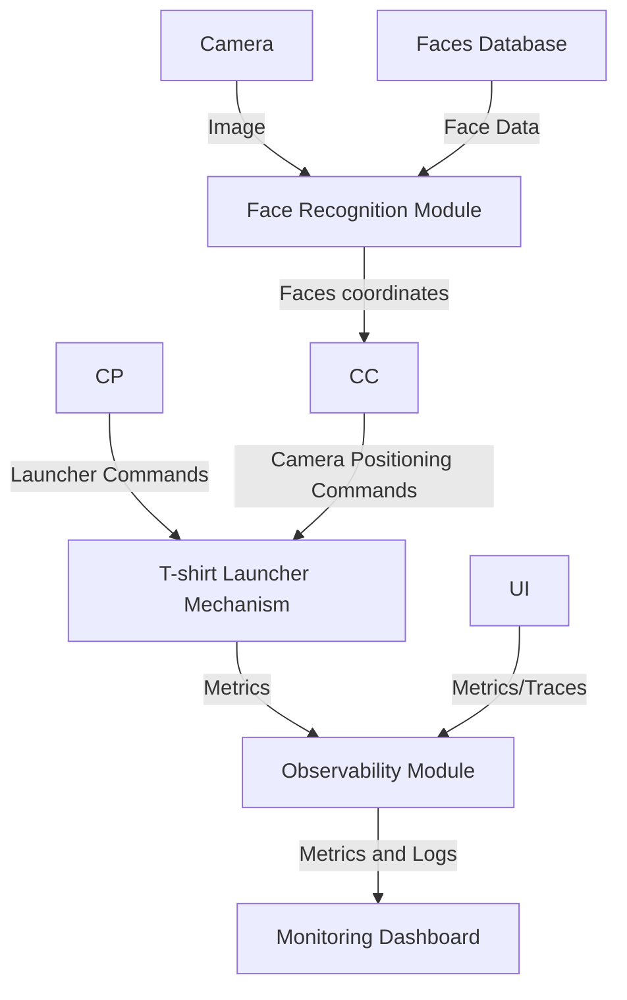

# T-Shirt Launcher Design Document

## 1. Introduction

### 1.1 Project Overview

The T-Shirt Launcher Project is an innovative initiative that combines fun with practical learning in software development. This project involves creating a Python-based application capable of controlling a t-shirt launcher using advanced concepts like face recognition and real-time camera control. The idea is to simulate a real-world software development scenario where developers must integrate various hardware and software components. This project is particularly significant in today's tech-driven world, where understanding the intersection of hardware and software is invaluable. This project is used as an end to end example for the Modern Python Development using ChatGPT book. Documents including this one are generated with help of ChatGPT speeding up the development process while ensuring the desired outcomes are met on time.

### 1.2 Purpose

The primary purpose of the T-Shirt Launcher Project is twofold:

- **Educational Value**: It serves as an excellent educational tool, providing hands-on experience in software development, computer vision, and hardware interaction.

- **Hobbyist Engagement**: It appeals to hobbyists and DIY enthusiasts, offering a platform to experiment with and learn about exciting technologies in a fun and engaging way.

#### 1.2.1 Inclusivity and Outreach through Cross-Platform Compatibility and Minimal Hardware Requirements

One of the core goals of the T-shirt Launcher project is to ensure inclusivity and outreach by making the software accessible to a wide range of users. This is achieved through:

##### Cross-Platform Compatibility

- By leveraging Python, the project ensures that the software can run seamlessly on various operating systems including Windows, Linux, and macOS. This cross-platform compatibility ensures that the software is accessible to a diverse audience, regardless of their preferred operating system.

##### Minimal Hardware Requirements

- The project's design emphasizes efficiency and minimal hardware requirements. This approach ensures that the software can run effectively even on resource-constrained devices, making it accessible to users who may not have access to high-end hardware.

These design choices reflect our commitment to inclusivity and outreach, ensuring that the T-shirt Launcher project is accessible and usable by as many people as possible, regardless of their technical or financial constraints. The software design will ensure that most functionality can be developed and tested using their laptop. The actual hardware of the T-Shirt launcher is optional.

The design chooses Commercial Off The Shelf (COTS) hardware to ensure that the developers are not overwhelmed by soldering or complex assembly. While pan and tilt mechanisms can be made relatively easily using servo motors, launching T-Shirts require air-pump, tight seal and triggers. This is hard to make and many things can go wrong. Using COTS we avoid these issues and focus on the core expertise that we want to develop which is faster SDLC.

### 1.3 Scope

The scope of this project extends beyond just writing code; it encompasses the end-to-end process of designing, implementing, and deploying a multifaceted system. Key aspects include:

- **Development**: Crafting a Python application that integrates with facial recognition libraries and controls camera hardware.

- **Platform Compatibility**: Ensuring the application is versatile, capable of running on various operating systems, including low-cost platforms like Raspberry Pi.

- **Target Audience**: Catering to a diverse audience ranging from software developers to educators and students in tech-related fields.

#### 1.3.1 Out of Scope

With the use of COTS we are limited by the speed of the hardware in terms of:

- Pan/tilt movement speed
- The maximum number of T-Shirts the launcher can hold
- The cycle time it takes to launch one T-Shirt

No work would be done to increase the performance of any of the above.

### 1.4 Stakeholders and Audience

The project caters to a wide range of stakeholders, each with their unique interests:

- **Software Developers and Engineers**: Gain experience in integrating software with physical hardware and real-time data processing.

- **Hobbyists and DIY Enthusiasts**: Explore the realms of hardware-software interaction in a fun and creative way.

- **Educators and Students**: Use the project as a learning tool to understand software development processes and hardware integration.

## 2. System Architecture

### 2.1 Documentation Architecture

### 2.1.1 Documentation, Setup, and Deployment (Addressing REQ-1)

To meet the requirements of REQ-1, the project will utilize a comprehensive documentation strategy. Key aspects include:

- **Markdown Documents**: Essential documentation, including setup instructions, usage guidelines, and troubleshooting steps, will be provided in Markdown format. These documents will be located in the project's GitHub repository for easy access and version control.

- **Setup Documentation**: Detailed setup documentation will be created using Python and Poetry. This will ensure that the setup process is well-documented, reproducible, and easy to follow.

- **GitHub Actions and Docker**: Utilizing GitHub Actions for continuous integration and Docker for containerization will simplify deployment processes. This approach allows for consistent and repeatable deployment environments, reducing the potential for discrepancies between development and production.

- **Observability Documentation**: The documentation will include a section on observability, outlining what metrics are tracked and how they are collected. A troubleshooting guide will be provided to assist users in resolving common issues, leveraging metrics and logs.

This approach to documentation ensures that all stakeholders, from developers to end-users, have access to clear, comprehensive, and up-to-date information about the project.

### 2.2 High-Level Architecture

The T-Shirt Launcher Project is structured around a modular and scalable architecture, designed to integrate various technologies seamlessly. This architecture is critical in handling the complexities of real-time image processing, hardware control, and software integration.

### 2.3 Architectural Components

This section addresses REQ-3, REQ-4, REQ-5.

- **Face Recognition Module**: Utilizes the `face_recognition` library, renowned for its accuracy and efficiency in facial recognition tasks. The choice of this library over alternatives like OpenCV's native facial recognition or deep learning-based approaches was driven by its ease of use and robust performance on diverse datasets.

- **Camera Control Module**: Employs OpenCV, a powerful open-source computer vision library. OpenCV was chosen for its comprehensive functionalities in image processing over other libraries due to its wide community support and extensive documentation.

- **Launcher Control Module**: Managed through Python's `usb` library, offering a straightforward approach to interfacing with USB devices. The decision to use Python's native `usb` library, as opposed to more complex hardware interfacing options, was made to maintain the project's accessibility and ease of replication.

### 2.4 High-Level Interaction


This diagram represents the cyclic and interdependent nature of the modules, highlighting the real-time data flow and control mechanisms.

### 2.5 Component Overview

Each component of the system plays a vital role in the overall functionality of the T-Shirt Launcher:

### 2.5.1 Face Recognition

- **Functionality**: Detects and tracks the target's face, providing real-time coordinates for the camera control system.

- **Alternative Considered**: Deep learning models were considered but deemed unnecessary for the project's scope and hardware limitations.

### 2.5.2 Camera Control

- **Functionality**: Adjusts the camera's position based on the input from the Face Recognition module.

- **Implementation Rationale**: By mounting the camera on the T-Shirt launcher itself, we control the camera position using the Launcher control. Camera controls would acknowledge the limitations of the T-Shirt launcher hardware. Algorithms would limit unnecessary movement. The Camera control has self correcting mechanisms that would launch the T-Shirt only when the launcher is not moving.

### 2.5.3 Launcher Control

- **Functionality**: Executes commands to position and fire the T-Shirt as directed by the input from Camera Control module.

- **Simplicity and Accessibility**: The usage of Python’s `usb` library simplifies the control mechanism, making it accessible to a wider range of developers and hobbyists.

## 3. Module Details

This section addresses REQ-3, REQ-4, REQ-5, REQ-6, REQ-7, REQ-8, and REQ-9.

This section details the main modules of the system. It includes section on defining scalability and how this design addresses the scalability concerns.



The above diagram will help in visually representing the relationship and data flow between different components such as the User Interface, Command Processor, Face Recognition Module, Camera Control, T-shirt Launcher Mechanism, and Observability Module.

### 3.1 Launcher Module

### Functionality

The Launcher module is the core component responsible for the physical operation of the t-shirt launcher. It handles the directional movement and firing mechanism based on received commands.

### Implementation

The module leverages Python's `usb` library to send control commands to the launcher. This approach was chosen for its simplicity and broad hardware compatibility.

### Code Snippet

```python
import usb.core
import usb.util

class Launcher(object):
    # Initialization and USB setup
    def __init__(self):
        # ... USB device setup ...

    # Method to move the launcher
    def move(self, direction):
        # ... Code to move the launcher ...

    # Method to fire the launcher
    def fire(self):
        # ... Code to fire the launcher ...
```

### Alternatives Considered

- Serial communication and other hardware interfacing techniques were considered but ultimately set aside in favor of USB for its universality and ease of use.

### 3.2 Tracker Module

### Tracker Functionality

The Tracker module is integral for the targeting system, utilizing face recognition to locate and track the target, and camera control for optimal target alignment.

### Tracker Implementation

Combines the `face_recognition` library for facial detection with OpenCV for camera control, a decision made to balance accuracy and processing efficiency.

### Tracker Code Snippet

```python
import face_recognition
import cv2

class Tracker(object):
    def __init__(self, video_source):
        # ... Initialization ...

    def track_target(self):
        # ... Face tracking and camera adjustment logic ...
```

### Alternative Approaches

- Advanced machine learning models were explored but were deemed unnecessary for the scope and desired simplicity of the project.

### 3.3 Main Module

### Main Module Functionality

The Main module serves as the orchestrator, ensuring smooth communication and coordination between the Tracker and Launcher modules.

### Module Implementation

This module integrates the functionalities of both the Tracker and Launcher, managing the flow of information and control commands.

### Tracker and Launcher Code Snippet

```python
from tracker import Tracker
from launcher import Launcher

class MainController(object):
    def __init__(self):
        self.tracker = Tracker()
        self.launcher = Launcher()

    def run(self):
        # ... Main execution loop ...
```

### Design Rationale

- The modular design enhances maintainability and allows for easier future expansions or modifications. By separating the tracker and launcher code, both can independently developed and tested.

### 3.4 User Interface

This section addresses REQ-2.

Autonomous mode is the default mode of operation. Additionally, for manual operation during debugging or testing, the system includes a keyboard override interface. This interface allows operators to manually control the pan and tilt mechanism of the camera, providing direct and precise adjustments as needed.

### 3.4.1 Non-Blocking User Input Handling (Addressing REQ-7)

### Design for Non-Blocking User Input

- To ensure responsive user interaction and meet the performance requirement (REQ-7) of responding to user inputs within 1 second, the system will implement non-blocking user input handling.

- The design includes the use of threads to manage user input separately from the main application logic. This approach prevents user input from blocking the execution of critical tasks such as face recognition and camera control.

### Thread-Based Input Handling

- The system will create a dedicated input handling thread that continuously monitors user inputs, including commands from event operators or system administrators.

- This thread will be responsible for receiving and processing user requests without disrupting the core functionality of the T-shirt launcher.

### Asynchronous Command Queue

- User input commands will be placed in an asynchronous command queue by the input handling thread. These commands can include instructions to launch T-shirts, adjust camera settings, or activate debugging features.

- The main application logic, including face recognition and camera movement, will periodically check this command queue for new instructions.

### User Input Prioritization

- User input commands will be prioritized to ensure that safety-critical commands, such as emergency stop requests, receive immediate attention.

- The system will maintain a predefined order of priority for different types of user commands to optimize responsiveness.

### Synchronization and Communication

- Proper synchronization mechanisms, such as locks or semaphores, will be implemented to ensure thread safety and prevent race conditions when accessing shared resources, including the command queue.

- The input handling thread and the main application logic will communicate through the command queue to exchange information and execute commands.

### Production Mode and Observability

- In production mode, the user interface is designed to operate in a headless mode, without a graphical user interface (GUI). This minimizes resource usage and ensures efficient performance on less powerful hardware.

- Metrics, logs, and errors are routed to observability solutions such as monitoring dashboards and log aggregators. This allows operators to monitor the system's health and performance in real-time.

### Debugging Features

- For debugging purposes during development and testing, the user interface provides a visual representation of face recognition.

- When in debugging mode, the system launches a graphical interface that displays the live video feed. It identifies detected faces and draws a red rectangle around each identified face.

- Additionally, the name attached to each recognized face is displayed alongside the rectangle, aiding in debugging and verification of face recognition accuracy.

### 3.5 Safety Features

### Limitation of Pan and Tilt Mechanism

- The safety features of the system include settings that prevent the pan and tilt mechanism from crossing the physical limits of the device, even when instructed to do so. This ensures that the mechanical components operate within safe parameters and avoids potential damage.

### T-shirt Presence Detection

- To enhance safety, the system is designed to disable the launch mechanism when there is no T-shirt present in the launcher. This is achieved through sensors and image recognition. If the system detects the absence of a T-shirt in the launch chamber, it automatically prevents the launch operation from being executed.

### 3.6 Product Safety Suggestions

### To further enhance the safety of the product, the following design suggestions are proposed

- Safety Interlocks: Implement safety interlocks that ensure the launcher cannot be activated unless all safety checks are passed. This includes verifying the presence of a T-shirt, confirming that the pan and tilt mechanisms are within safe limits, and checking for any obstructions in the launch path.

- Emergency Stop Button: Incorporate an emergency stop button or mechanism that allows operators to quickly halt the launcher's operation in case of any unforeseen issues or emergencies.

- User Training and Guidelines: Provide comprehensive user training and safety guidelines for operators. Ensure that they are aware of the proper procedures for setting up and operating the T-shirt launcher safely.

### 3.7 Scalability

Scalability is a critical aspect of the T-shirt Launcher project, encompassing various dimensions, including platform support and deployment flexibility. This section discusses how the system addresses these scalability concerns.

### 3.7.1 Cross-Platform Compatibility

The T-shirt Launcher project leverages Python as its primary programming language, which inherently contributes to cross-platform compatibility.

### Implementation Details

- **Python's Cross-Platform Nature**: Python is renowned for its cross-platform compatibility. The choice of Python as the primary programming language ensures that the codebase can run seamlessly on a wide range of operating systems, including Windows, Linux, and macOS. This cross-platform support simplifies deployment and enables the system to operate consistently across different environments.

### 3.7.2 Minimal Hardware Requirements

The project's simplicity in facial recognition algorithms and efficient code design allows it to run effectively on minimal computer hardware, making it suitable for resource-constrained environments.

### Software Implementation Details

- **Simplicity of Facial Recognition Algorithms**: The system employs straightforward facial recognition algorithms that do not demand extensive computational resources. These algorithms focus on key facial features, enabling the software to operate on minimal hardware without compromising accuracy.

- **Lightweight Codebase**: The codebase is designed to be lightweight, minimizing memory and processing requirements. This lightweight nature ensures that the system can be deployed on hardware with tight constraints while delivering reliable performance.

### 3.7.3 Modularity for Adaptability

The modularity of the system is a key factor in its scalability. It allows for easy adaptation to different hardware configurations and deployment scenarios.

### Modularity Implementation Details

- **Component-Based Architecture**: The system is structured around a component-based architecture, where each functional component is modular and self-contained. This modularity enables individual components to be easily replaced or upgraded without affecting the overall system.

- **Customization for Specific Scenarios**: Event operators can customize the system's configuration based on specific event requirements. For example, they can adjust camera parameters, facial recognition settings, and launcher behavior to suit the event's needs. This level of customization enhances adaptability.

- **Efficient Inter-Component Communication**: Communication between modules is designed to be efficient and well-defined. Modules communicate through well-defined interfaces, allowing for seamless integration with third-party components or future enhancements.

### 4.1 Testing Strategies

### 4.1.1 Unit Testing

Unit tests are crucial for ensuring that each component of the T-Shirt Launcher system functions as expected in isolation.

- **Tools**: Python's `pytest` framework is chosen for its powerful features and ease of writing and running tests.

- **Implementation**: Writing test cases for each function in the modules, using mock objects and fixtures to isolate the tests from external dependencies.

- **Code Snippet**:

```python
import pytest
from unittest.mock import MagicMock, patch
from tracker import Tracker
from tshirt_launcher import Launcher  # Assuming Launcher is in tshirt_launcher.py

@pytest.fixture
def mock_launcher():
    # Creating a mock for the Launcher module
    mock = MagicMock(spec=Launcher)
    # Setup the mock as needed, e.g., setting return values for methods
    mock.aim.return_value = None
    mock.fire.return_value = None
    return mock

@pytest.fixture
def tracker_with_mocked_launcher(mock_launcher):
    # Patching the Launcher instance within the Tracker module
    with patch('tracker.Launcher', mock_launcher):
        # Initialize the Tracker with the mocked Launcher
        tracker = Tracker()
        yield tracker

def test_tracker_initialization(tracker_with_mocked_launcher):
    # Test the initialization of the Tracker module with a mocked Launcher
    tracker = tracker_with_mocked_launcher
    assert tracker is not None  # Basic check to ensure tracker object is created
    assert tracker.launcher is not None  # Check if the launcher is mocked and assigned
    # Additional checks can be added as needed
```

### 4.1.2 Integration Testing

Integration tests validate that different modules of the application work together correctly.

- **Approach**: Simulating real-world scenarios where the modules interact, such as tracking a face and activating the launcher.

- **Code Snippet**:

  ```python
  def test_integration_tracker_launcher():
    # Example code for integration testing combining Tracker and Launcher modules
    tracker = Tracker()  # Initialize the Tracker
    launcher = Launcher()  # Initialize the Launcher, assuming a Launcher class in tshirt_launcher.py

    tracker.start_tracking()  # Start the tracking process
    target = tracker.get_target()  # Get the target position

    assert target is not None  # Check if a target is acquired

    launcher.aim(target)  # Aim the launcher at the target
    launcher.fire()  # Fire the t-shirt launcher

    # Additional assertions and checks can be added to validate the integration
  ```

### 4.1.3 UI Testing

The project includes a user interface for development and debugging purposes. UI testing ensures that it is functional and user-friendly. Given that this is a hobby project it would be an overkill to implement full UI testing. UI tests are notoriously flaky and maintenance is hard. Many projects require a minimal level of UI testing. In this book we shall use ChatGPT to generate snippets to show some examples. The making it work part is out of scope for this book.

- **Tools**: Use of `Selenium` or `robot` automating user interface testing.

## 5. Deployment and Maintenance

### 5.1 Docker Deployment on Raspberry Pi with USB Device Interaction

### Overview

Deploying the T-Shirt Launcher application on Raspberry Pi using Docker provides consistency and isolation from the host OS. It's ideal for hardware-interacting applications, such as those involving USB devices.

### Docker Deployment Strategy

- **Rationale**: Docker's containerization ensures the application runs in a controlled environment with all dependencies, minimizing host system conflicts and ensuring consistent behavior across platforms.

- **Alternatives Considered**: Before Docker, virtualization and direct OS installation were considered. Virtualization was too resource-intensive for Raspberry Pi, and direct installation posed dependency and replicability issues.

### USB Device Interaction

- **Challenges and Solutions**: The main challenge is enabling containerized applications to interact with USB devices. This is resolved by mapping USB device files from the host to the container using Docker’s `--device` flag, facilitating direct communication.

- **Mermaid Diagram for USB Access**:

  ```mermaid
  graph TD
    A[Docker Container] -->|Access| B[USB Device]
    B -->|Mounted| C[Host OS]
    C -->|Connected| D[Raspberry Pi USB Port]
  ```

### Implementation Steps

1. **Docker Installation**: Using package managers or Docker scripts, focusing on ARM compatibility.
2. **Building the Docker Image**: Tailoring the Dockerfile for ARM architecture, including all dependencies.
3. **Configuring USB Access**: Identifying USB devices with `lsusb` and passing them to the Docker container with the `--device` flag.

### 5.2 Continuous Deployment with GitHub Actions

### CI/CD Overview

GitHub Actions for continuous deployment automates updates, enhancing reliability and efficiency.

### GitHub Actions for Raspberry Pi

- **Approach**: Automatic updates deployment using GitHub Actions, with self-hosted runners on Raspberry Pi for control and customization.

- **Implementation Steps**:
  1. **Setting Up Self-Hosted Runner**: Install and configure on Raspberry Pi, ensuring secure communication.
  2. **Workflow Configuration**: Define automated testing, building, and deployment workflows in `.github/workflows`, triggered by specific branch or directory changes.

### Considerations

- **Security**: Secure communication and access between GitHub and Raspberry Pi is crucial.

- **Network Stability**: A stable network connection is essential for uninterrupted deployment.

### 5.3 Resiliency and Crash Handling

### Process Supervision

- **Systemd**: Managing the application as a systemd service on Raspberry Pi ensures automatic start on boot and restart on failure, offering robust service availability.

- **Alternative Tools**: Other managers like Supervisor were considered but systemd was preferred for its OS integration.

### Crash Recovery Mechanisms

- **Strategies**: Implementing automatic recovery mechanisms includes restarting the service and performing pre-restart checks or cleanup for smooth operation resumption.

### 5.4 Upgrade Handling

### CI/CD Pipeline Integration

- **Rationale**: CI/CD pipelines maintain code quality and automate deployment, reducing errors and manual intervention.

- **Tools**: GitHub Actions are used for their repository integration, providing streamlined code integration and deployment.

### Rollback Strategies

- **Approach**: Maintaining versioned Docker images enables quick rollbacks to stable versions if needed.

### 5.5 Maintenance and Future Upgrades

### Regular Updates and Dependency Management

- **Strategy**: Regular updates of the application and dependencies, including Docker images and Raspberry Pi OS, are crucial for security and performance.

### Scalability and Feature Extensions

- **Planning**: Scalability considerations and potential feature additions are part of future upgrade plans.

## 6. Observability

### 6.1 Overview

Effective observability is crucial for monitoring the performance and health of the T-Shirt Launcher application. It involves collecting key metrics, logs, and traces to ensure the application meets its objectives and key results (OKRs).

### 6.2 Key Metrics Aligned with OKRs

- **Application Performance Metrics**: Response times, error rates, and system resource usage (CPU, memory).

- **User Engagement Metrics**: Number of targets successfully tracked and hit, which directly correlates with the OKRs related to user engagement and satisfaction.

- **System Reliability Metrics**: Uptime percentages and incident counts, ensuring high reliability as outlined in the OKRs.

### 6.3 Rationale Behind Tool Selection

- **Grafana**: Chosen for its powerful data visualization capabilities, allowing for the creation of comprehensive dashboards that provide real-time insights into the application's performance and health.

- **Prometheus**: Selected for its robustness in time-series data monitoring and its compatibility with Grafana, making it an ideal choice for tracking key metrics.

- **OpenTelemetry**: Adopted for its versatility in collecting and exporting telemetry data (traces, metrics, and logs), enhancing the observability of the system.

### 6.4 Integration with Prometheus and OpenTelemetry

### Prometheus Integration

- **Python Integration**:

  ```python
  from prometheus_client import start_http_server, Counter
  import time

  # Create a counter metric
  requests_counter = Counter('app_requests_total', 'Total requests')

  # Start the Prometheus client
  start_http_server(9091)

  def handle_request():
      # Increment the counter
      requests_counter.inc()
      # Handle the request (placeholder for actual logic)
      time.sleep(0.1)

  if __name__ == "__main__":
      while True:
          handle_request()
  ```

- **Metrics Exposition**: The Prometheus client exposes the metrics at `http://localhost:9091`, which Prometheus scrapes at regular intervals.

### OpenTelemetry Integration

- **Python Integration**:

  ```python
  from opentelemetry import trace
  from opentelemetry.exporter.otlp.proto.http.trace_exporter import OTLPSpanExporter
  from opentelemetry.sdk.trace import TracerProvider
  from opentelemetry.sdk.trace.export import BatchSpanProcessor

  # Set up the TracerProvider and SpanProcessor
  trace.set_tracer_provider(TracerProvider())
  tracer = trace.get_tracer(__name__)
  span_processor = BatchSpanProcessor(OTLPSpanExporter())
  trace.get_tracer_provider().add_span_processor(span_processor)

  with tracer.start_as_current_span("example_span"):
      # Example span for tracing (placeholder for actual logic)
      pass
  ```

- **Data Export**: Traces are exported to an observability backend (e.g., Grafana Cloud) using the OTLP exporter.

### 6.5 Syslog Configuration for Log Collection

- **Syslog Setup**: Configure the application to send logs to the system's syslog, which can be forwarded to an external log management system.

- **Example Configuration**:

  ```ini
  [syslog]
  type = "syslog"
  path = "/dev/log"
  tag = "tshirt-launcher"
  ```

### 6.6 Observability Architecture

- **Mermaid Diagram**:

  ```mermaid
  graph TD
    A[Application] -->|Metrics| B[Prometheus]
    A -->|Traces| C[OpenTelemetry]
    A -->|Logs| D[Syslog]
    B -->|Scrape| E[Grafana]
    C -->|Export| E
    D -->|Forward| F[Log Management]
    E -->|Visualization| G[Users]
    F -->|Analysis| G
  ```

- **Description**: The application exports metrics to Prometheus, traces to OpenTelemetry, and logs to Syslog. Prometheus and OpenTelemetry data are visualized in Grafana, while logs are analyzed in a separate log management solution.

### 6.7 Grafana Cloud Integration

- **Setup**: Configure Grafana Cloud as the visualization platform for metrics from Prometheus and traces from OpenTelemetry.

- **Dashboards**: Create custom dashboards in Grafana Cloud to display the key metrics and traces, providing real-time insights into the application's performance and meeting the OKRs.

## 7. Future Enhancements and Upgrades

### 7.1 Overview

Continual improvement and adaptability are key to the long-term success and relevance of the T-Shirt Launcher project. This section outlines potential future enhancements and upgrade paths to keep the project technologically advanced and aligned with user needs.

### 7.2 Scalability Improvements

### Enhanced Performance Scaling

- **Objective**: To ensure the application can handle an increasing number of users and more complex operations without performance degradation.

- **Approach**: Implementing more efficient algorithms, optimizing code, and considering parallel processing where applicable.

- **Alternatives**: Scaling hardware resources; however, optimizing the software is often more cost-effective and sustainable.

### Cloud Integration

- **Objective**: Explore cloud deployment options for increased scalability and reliability.

- **Rationale**: Cloud platforms offer scalable infrastructure which can be adjusted based on demand, ensuring high availability and performance.

- **Consideration**: Balancing the benefits of cloud deployment with the costs and complexities involved.

### 7.3 Feature Extensions

### Advanced Targeting Capabilities

- **Objective**: Enhance the targeting system of the launcher for more complex and dynamic scenarios.

- **Approach**: Integrate more advanced computer vision techniques and machine learning models to improve accuracy and adaptability.

- **User Impact**: Such improvements would directly enhance user engagement, contributing to the project's OKRs.

### User Interface Improvements

This design addresses REQ-2.

- **Objective**: Develop a more intuitive and feature-rich user interface.

- **Rationale**: A user-friendly interface enhances the accessibility and usability of the application, thereby improving user satisfaction.

- **Technologies to Consider**: Implementing web-based interfaces or mobile applications for remote control and monitoring.

### 7.4 Software and Hardware Integration

### IoT Integration

- **Objective**: Explore Internet of Things (IoT) capabilities to enhance the launcher's interactivity and smart features.

- **Approach**: Incorporating IoT protocols and standards for remote control and data collection.

- **Benefit**: IoT integration can lead to new use cases and expand the project’s appeal to a broader audience.

### Compatibility with Additional Hardware

- **Objective**: Ensure the software remains compatible with a wider range of hardware, including newer models of Raspberry Pi and other single-board computers.

- **Strategy**: Regular testing on different hardware setups and maintaining a modular architecture for easy adaptation.

### 7.5 Continuous Improvement

### Regular Updates and Refactoring

- **Objective**: Keep the software up-to-date with the latest technologies and best practices.

- **Approach**: Periodic code refactoring, dependency updates, and adopting new technologies as they become relevant and stable.

- **Impact on Maintenance**: Regular updates simplify maintenance and prevent the accumulation of technical debt.

### Community Feedback and Contributions

- **Objective**: Encourage community involvement for a diverse range of ideas and improvements.

- **Method**: Establishing a robust community contribution process, including clear guidelines, responsive support, and acknowledgment of contributors.

### 7.6 Mermaid.js Diagram for Future Architecture

- **Diagram**:

  ```mermaid
  graph LR
    A[Current Application] -->|Enhance| B[Advanced Targeting System]
    A -->|Integrate| C[Cloud Platforms]
    A -->|Expand| D[User Interface]
    A -->|Incorporate| E[IoT Capabilities]
    A -->|Test on| F[Additional Hardware]
    B -->|Feedback to| A
    C -->|Feedback to| A
    D -->|Feedback to| A
    E -->|Feedback to| A
    F -->|Feedback to| A
  ```

- **Description**: The diagram illustrates the feedback loop between the current application and various future enhancements, highlighting the iterative nature of the development process.

### 7.7 Conclusion

Future enhancements and upgrades are crucial for the T-Shirt Launcher project's growth and sustainability. Embracing technological advancements, adapting to user needs, and fostering community involvement are essential for continuous improvement and innovation.
