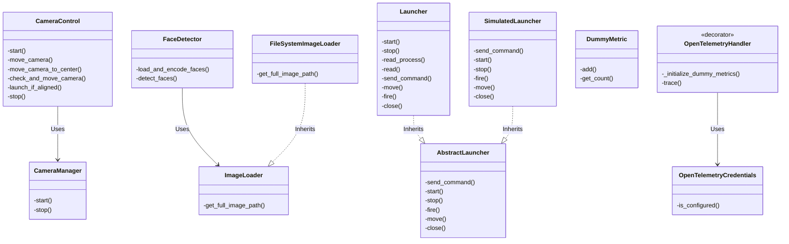
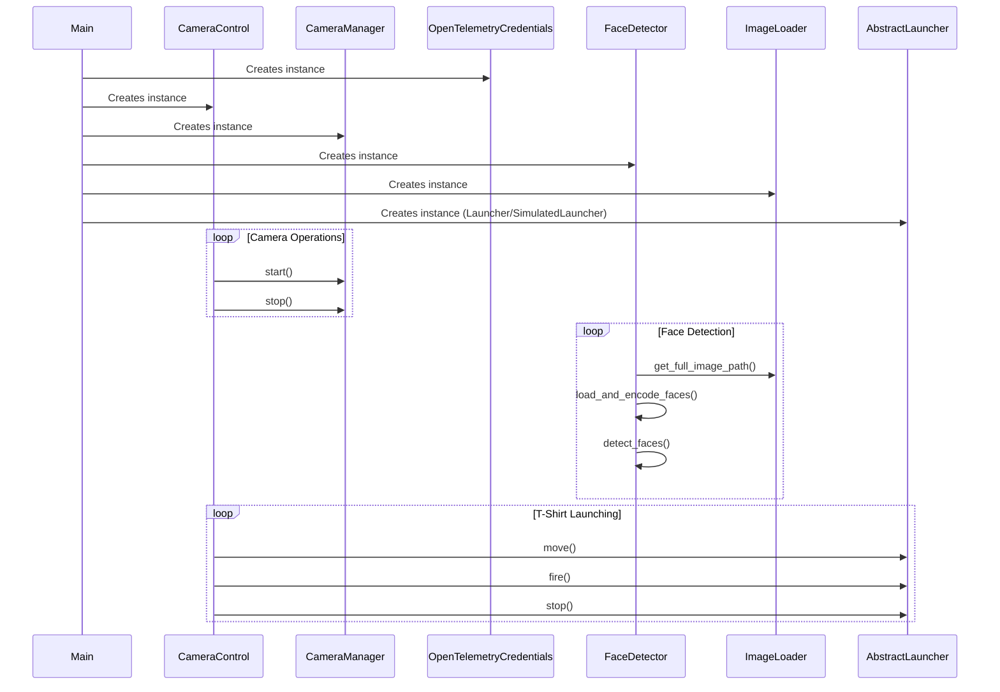

# System Design Documentation

## Overview

This document provides an overview of the design and architecture of the camera control and face detection system, including the t-shirt launcher control mechanism. It includes UML class diagrams and sequence diagrams to illustrate the relationships and interactions between various components.

## Class Diagram

The following class diagram represents the structure of the system, showing classes, their methods, and relationships.

## Sequence Diagram

The sequence diagram below shows the interactions between the classes during the operation of the system.

